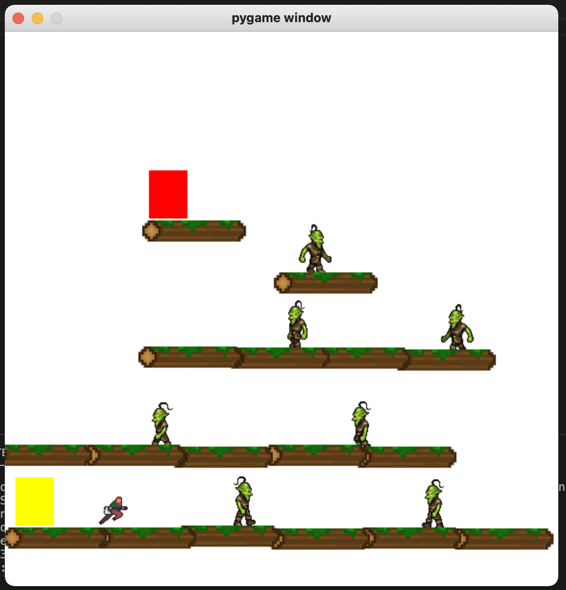

# The-Adventures-of-Snickerdood

## Description
This is a very simple platforming game made with pygame, about the adventures of snickerdood the lumberjack and his search for the lost snickerdoodles (or something like that).

## How to set it up
IDE and Python, plus pygame installed.

## How to make levels
Go to the file called levelEditor.py and run that. Here are the commands to use:  
* Press n to enter the name of the world
* Press d to set the starting door, and then d again for the ending door
* Press f to make floors
* Press s to save the level **and to move on to the next level**
* Press e to make enemies
* Press delete or backspace to remove the last floor or enemy placed    
    
This will create a new folder that contains the files of the individual levels in the world.  
After that go to menu.py and type the name of the folder (the name of the world) into one of the level#Name variables (in __init__ in the Menu() class).

## How to run the game
Go to main.py and run it!

Use the arrow keys or "WASD" the move character, and spacebar to shoot.

## Useful links
[pygame documentation](https://www.pygame.org/docs/)  
[Some very useful example games](http://programarcadegames.com/index.php?chapter=example_code_platformer&lang=en)

gameplay.png
